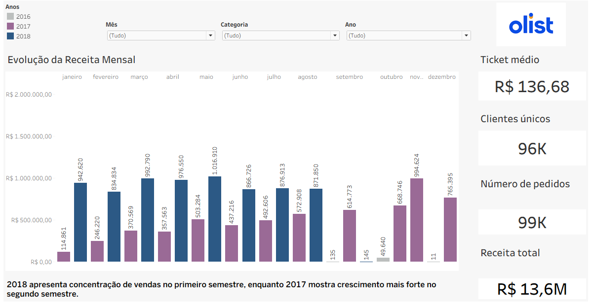
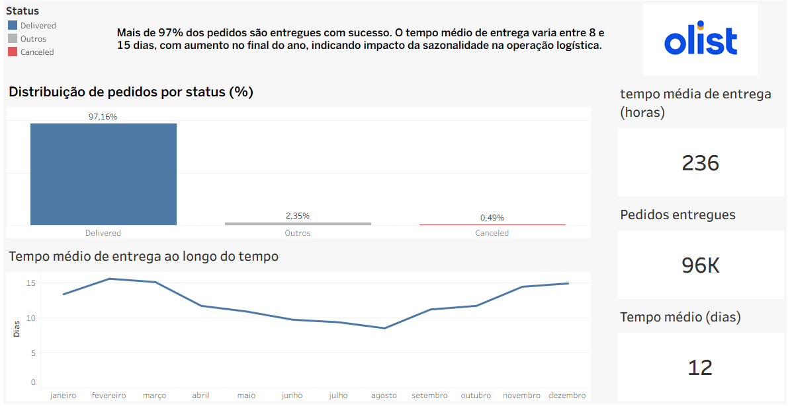
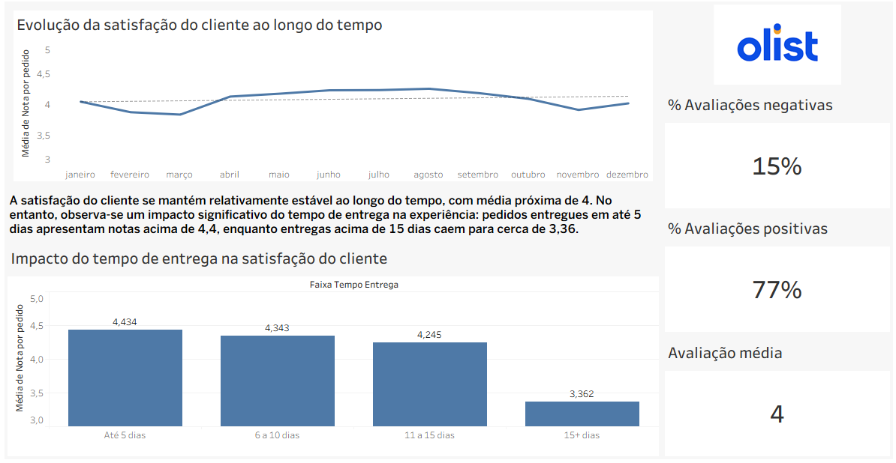

# 📊 Análise de Dados - Olist E-commerce

## 📌 Sobre o projeto
Este projeto tem como objetivo analisar dados de um e-commerce (Olist), com foco em indicadores de negócio, logística e experiência do cliente.

Através da construção de dashboards no Tableau, foram explorados padrões de receita, desempenho operacional e fatores que impactam a satisfação dos clientes.

---

## 🎯 Objetivos da análise
- Analisar a evolução da receita ao longo do tempo
- Avaliar o desempenho logístico das entregas
- Entender a satisfação do cliente
- Identificar fatores que impactam a experiência do consumidor

---

## 🛠️ Ferramentas utilizadas
- Tableau (visualização de dados)
- Excel (tratamento e organização)

---

## 📊 Dashboards

### 📈 Visão de Negócio
Análise dos principais indicadores de performance do e-commerce, como receita, número de pedidos e ticket médio.

---

### 🚚 Logística
Avaliação do desempenho operacional, incluindo tempo de entrega e distribuição de pedidos por status.

---

### ⭐ Experiência do Cliente
Análise da satisfação do cliente ao longo do tempo e identificação dos fatores que influenciam as avaliações.

---

## 💡 Principais Insights

- A satisfação do cliente se mantém relativamente estável ao longo do tempo, com média próxima de 4
- Existe uma relação direta entre o tempo de entrega e a avaliação do cliente
- Pedidos entregues mais rapidamente apresentam notas significativamente mais altas
- Entregas acima de 15 dias reduzem de forma relevante a satisfação

---

## 📈 Conclusão

A análise demonstra que a logística exerce papel fundamental na experiência do cliente.  
Melhorias no tempo de entrega podem impactar diretamente a satisfação, retenção e percepção de valor do consumidor.

---

## 🚀 Sobre mim
Sou estudante de Administração pela UNICAMP com foco em análise de dados e Business Intelligence.

Tenho interesse em transformar dados em insights que apoiem decisões de negócio, especialmente nas áreas de performance, operação e experiência do cliente.

🔗 [LinkedIn](https://www.linkedin.com/in/brunorosaoliveira)
